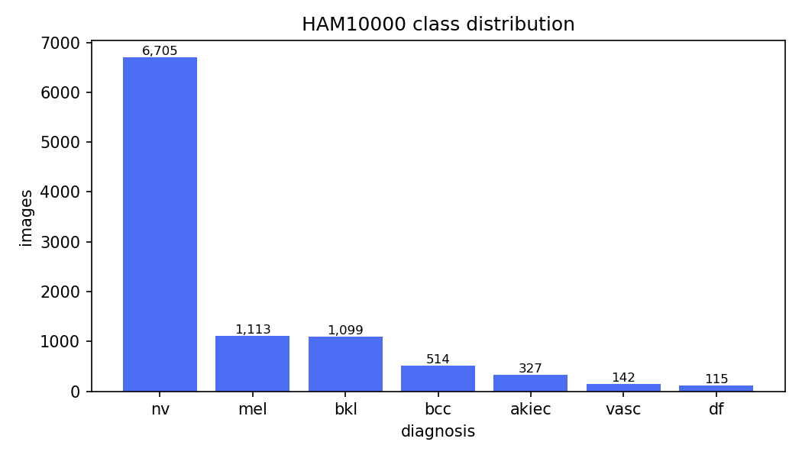
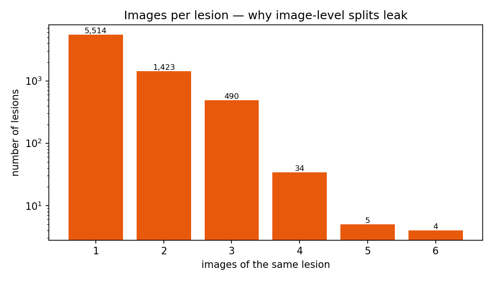
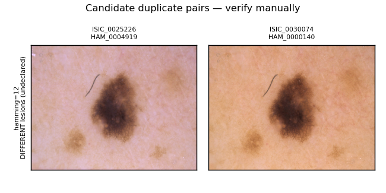
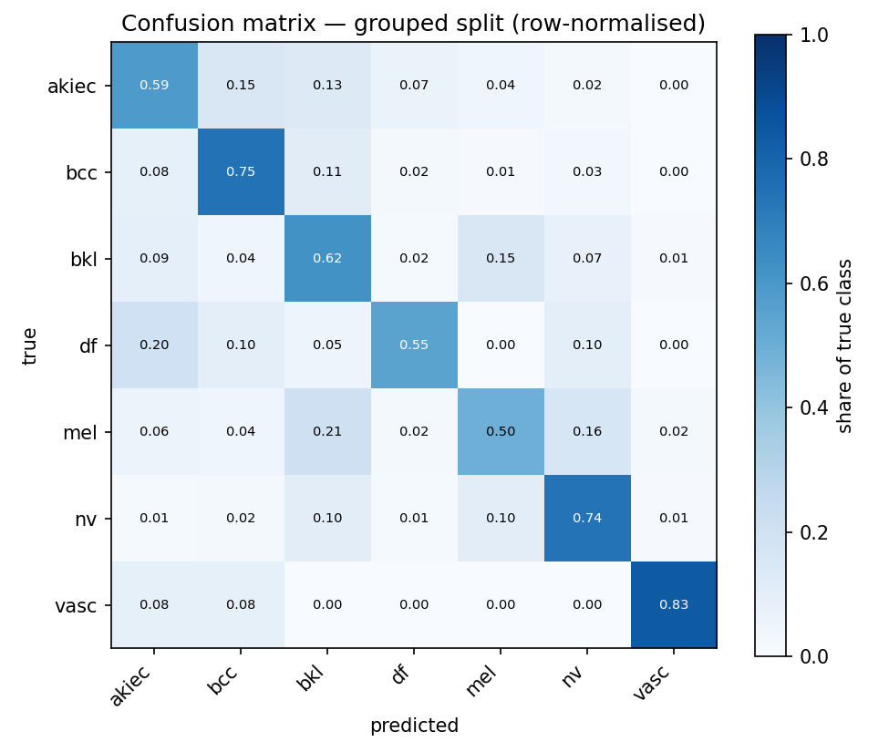
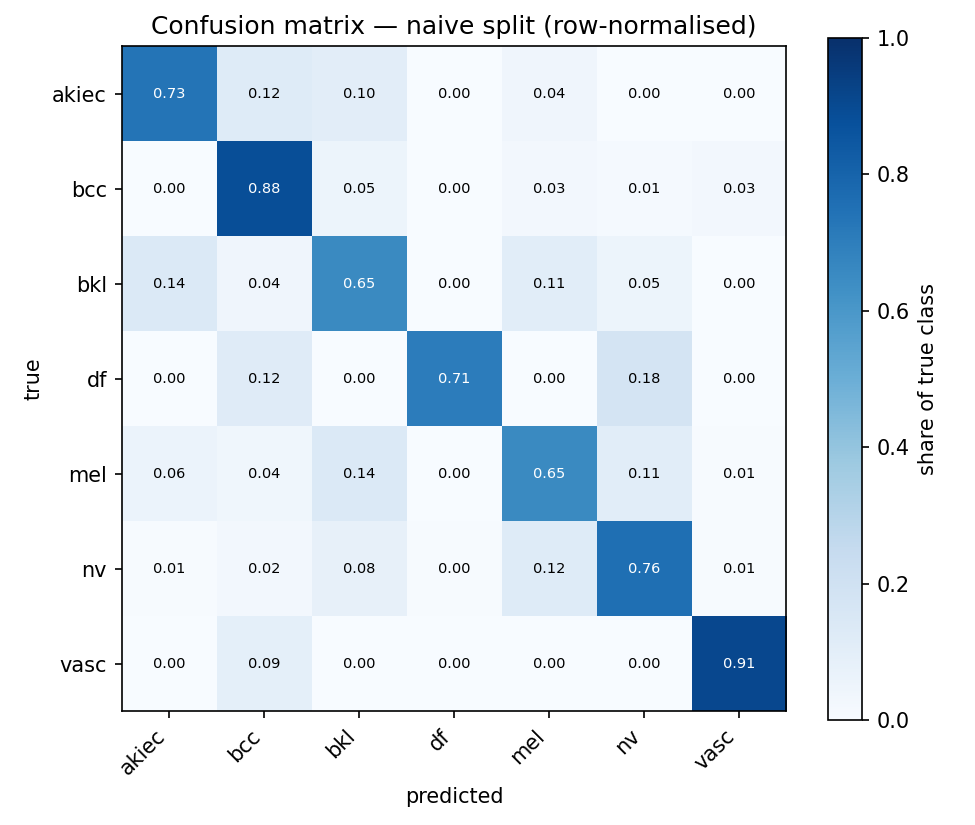

<h1 align="center">🔬 Skin Lesion Classification — A Leakage-Aware Benchmark</h1>

<p align="center">
  <i>Most skin-lesion classifiers are evaluated on splits that leak.<br>
  This project measures how much that inflates results — and re-benchmarks honestly.</i>
</p>

<p align="center">
  <b>On HAM10000, a standard random train/test split leaves 40.6% of the "held-out"<br>
  test set showing lesions the model already trained on — inflating reported<br>
  balanced accuracy by 10.3 points and melanoma recall by 15.8.</b>
</p>

<p align="center">
  
  
  
  
  
</p>

> ⚠️ **Not a clinical tool.** This is a research and educational project. It is not validated
> for diagnostic use and no clinical claims are made.

---

## The problem

[HAM10000](https://www.nature.com/articles/sdata2018161) is one of the most widely used
dermatoscopic image datasets — 10,015 images across 7 diagnostic classes. Portfolio projects
and papers alike routinely report 90%+ accuracy on it.

There's a catch buried in the metadata. Each row has **both** an `image_id` and a `lesion_id`,
and **multiple images map to the same physical lesion** — the same mole photographed more than
once, at different angles or magnifications.

Split the data randomly *by image* — which is what most tutorials do — and images of the **same
lesion land in both the training and test sets**. The model no longer has to learn what melanoma
looks like; it can recognise *that particular mole*. Test accuracy goes up. The model gets worse.

Independent audits have also found **true duplicate pairs beyond the metadata**: image pairs
labelled as different lesions that manual review confirms are the same lesion, some of which
straddle the train/test boundary.

## The question

> **How much of the reported performance of skin-lesion classifiers is an artefact of data
> leakage — and what does an honest benchmark look like?**

## The approach

The experiment is deliberately simple, because the *split* is the independent variable:

1. **Audit** the dataset for duplicate and near-duplicate images — via perceptual hashing and
   CNN embedding similarity — on top of the lesion grouping already visible in the metadata.
2. **Build two splits** with identical ratios, stratification and seed:
   - **Split A (naive)** — random at the *image* level. Leaky by construction. Kept on purpose.
   - **Split B (grouped)** — grouped by `lesion_id`, with discovered duplicate groups merged in.
3. **Train the same model twice**, changing nothing but the split.
4. **The difference in test performance is the leakage effect.** That gap is the result.
5. **Benchmark honestly** on Split B with the metrics imbalanced medical data actually requires —
   balanced accuracy, macro-F1, per-class recall, bootstrap confidence intervals, calibration.
6. **Interpret** with Grad-CAM, checking whether the model attends to the lesion or to imaging
   artefacts (rulers, ink marks, hair, vignetting).

This project is **not** attempting state-of-the-art. It's attempting an honest number.

## Findings so far

### 1 · A quarter of the dataset is redundant

Running `python -m src.data.profile` on the real HAM10000:

| | |
|---|---|
| Images | **10,015** |
| Unique lesions | **7,470** |
| Lesions with more than one image | **1,956** |
| Most images of a single lesion | **6** |
| **Redundant images** | **2,545 (25.4%)** |

**One in four images is another view of a lesion already in the dataset.** Those images
are not independent samples, and a split that treats them as if they were is measuring
the wrong thing.

Analytically, that implies **~40% of a naive random test set** would contain a lesion the
model already saw during training. (Measured empirically in finding 2.)

### 2 · Class imbalance makes plain accuracy meaningless

| class | count | share |
|---|---:|---:|
| `nv` melanocytic nevi | 6,705 | 67.0% |
| `mel` melanoma | 1,113 | 11.1% |
| `bkl` benign keratosis | 1,099 | 11.0% |
| `bcc` basal cell carcinoma | 514 | 5.1% |
| `akiec` actinic keratoses | 327 | 3.3% |
| `vasc` vascular lesions | 142 | 1.4% |
| `df` dermatofibroma | 115 | 1.2% |

A model predicting `nv` for every image scores **67% accuracy** while being clinically
useless — it would miss every melanoma. This is why the benchmark reports **balanced
accuracy, macro-F1 and per-class recall** rather than raw accuracy.

<p align="center">
  
  
</p>

### 3 · A naive split contaminates 40.6% of the test set

`python -m src.data.splits` builds both splits and measures contamination directly —
what share of test images share a lesion with something the model trained on:

| | Split A (naive) | Split B (grouped) |
|---|---:|---:|
| Test images | 1,503 | 1,669 |
| **Test images sharing a lesion with train/val** | **610 (40.6%)** | **0 (0.0%)** |

**Two in five test images in the naive split are not held out at all.** The model has already
seen that exact lesion, usually photographed seconds apart at a slightly different angle.

The analytic estimate in finding 1 predicted **40.3%**; direct measurement gives **40.6%**.
Two independent methods agreeing to within 0.3 points is a good sign the effect is real
rather than an artefact of one particular random seed.

Class stratification held in both splits (every class within ~0.1pp of its population share),
so the *only* meaningful difference between them is the leakage. That's what makes the
head-to-head model comparison valid.

### 4 · Perceptual hashing independently rediscovers the lesion groupings

`python -m src.data.audit --phash` found **25 candidate duplicate pairs**:

| | |
|---|---:|
| Candidate pairs (Hamming ≤ 12) | 25 |
| Already declared — same `lesion_id` | 24 |
| **Undeclared — different `lesion_id`** | **1** |

**24 of 25 pairs were images the metadata already groups under one lesion.** The detector
didn't know about `lesion_id`; it found those pairs purely from pixels. That independent
agreement is a strong precision signal.

**The one undeclared pair is a genuine finding.** `ISIC_0025226` and `ISIC_0030074` are
filed under different lesions (`HAM_0004919`, `HAM_0000140`) but visual inspection shows
the same mole outline, the same satellite freckles in the same positions, and the same
hair strand — differing only in white balance:

<p align="center">
  
</p>

It sat at Hamming distance 12, exactly the threshold, and my first instinct was to call it
a false positive. Looking at the pixels showed otherwise. **This is why the contact sheet
exists** — threshold proximity is not evidence of anything on its own. The pair is merged
into the grouped split: 7,470 lesions become 7,469 effective groups.

### 5 · Embedding similarity: 19 apparent discoveries that were all false positives

At cosine ≥ 0.98, ResNet-50 embeddings returned **63 pairs: 44 declared, 19 undeclared**.
Nineteen undeclared duplicates would have been a far bigger finding than pHash's one — and
it would have been wrong.

Three diagnostics raised suspicion before any conclusion was drawn:

| Signal | Observation | Reading |
|---|---|---|
| Similarity spread | All 19 fall in **0.9801–0.9847** | Hugging the cutoff, not confidently similar |
| Class composition | **18 of 19 are `nv`~`nv`** | `nv` is 67% of the data and visually homogeneous |
| Pair structure | `ISIC_0032452` appears in **5** different pairs | A true duplicate has one partner, not five |

A threshold sweep settled it. `--sweep` reports, at each cutoff, what fraction of hits are
pairs the metadata *independently* confirms as one lesion — those are known-correct
detections, so the declared rate is a proxy for precision:

| threshold | pairs | declared | undeclared | declared rate |
|---:|---:|---:|---:|---:|
| 0.980 | 63 | 44 | **19** | 0.698 |
| **0.985** | **24** | **24** | **0** | **1.000** |
| 0.990 | 8 | 8 | 0 | 1.000 |
| 0.995 | 4 | 4 | 0 | 1.000 |
| 0.999 | 2 | 2 | 0 | 1.000 |

**Every one of the 19 disappears between 0.980 and 0.985.** Above 0.985 the detector agrees
with the metadata 100% of the time. They were not duplicates; they were distinct nevi
sitting in a narrow noise band, where ImageNet features stop encoding *this lesion* and
start encoding *"round brown lesion on pale skin"* — a description fitting thousands of
genuinely different images.

Visual inspection confirmed it: the 19 pairs show visibly different moles that share only
their general appearance and imaging setup — nothing like the freckle-for-freckle match of
the verified pHash pair.

**The threshold is therefore set to 0.985** (`config.yaml`), chosen from this sweep rather
than by eye. At that setting the embedding detector contributes 24 pairs, all confirmed, and
adds no new undeclared duplicates. The effective grouping stands at **7,469 groups from
7,470 lesions** — the single pHash-verified pair.

> ⚠️ **Method note:** pHash catches near-identical pixels but misses the same lesion shot
> from a different angle. Embeddings catch angle changes but over-fire on homogeneous
> classes. Neither is sufficient alone, and neither output is ground truth — which is why
> every undeclared candidate is verified by eye before it changes a split.

Reproduce the sweep (embeddings are cached, so it takes seconds after the first run):

```bash
python -m src.data.audit --embeddings --sweep --contact-sheet
```

### 6 · The leakage effect: +10.3 points of balanced accuracy

An EfficientNet-B0, ImageNet-pretrained, trained twice. Identical backbone,
hyperparameters, augmentation, class weighting, schedule and seed. **The split is the
only variable.**

| metric | Split A (naive) | Split B (grouped) | Δ |
|---|---:|---:|---:|
| Accuracy | 0.7412 | 0.6928 | **+0.048** |
| **Balanced accuracy** | **0.7566** | **0.6536** | **+0.103** |
| Macro F1 | 0.6740 | 0.5388 | **+0.135** |

95% bootstrap CIs on balanced accuracy: naive **[0.711, 0.797]**, grouped
**[0.603, 0.703]**. The intervals are **disjoint**, so the gap is not sampling noise.

#### The clinically important number

Balanced accuracy is the headline, but per-class recall is where it bites:

| class | naive recall | grouped recall | Δ |
|---|---:|---:|---:|
| **mel** (melanoma) | **0.6527** | **0.4950** | **+0.158** |
| akiec | 0.7347 | 0.5870 | +0.148 |
| bcc | 0.8831 | 0.7453 | +0.138 |
| df | 0.7059 | 0.5500 | +0.156 |
| vasc | 0.9091 | 0.8333 | +0.076 |
| bkl | 0.6545 | 0.6231 | +0.031 |
| nv | 0.7565 | 0.7413 | +0.015 |

**A leaky evaluation reports that the model catches 65% of melanomas. Evaluated honestly,
it catches 50%.** A clinician told the first number would draw a very different conclusion
from one told the second.

Note the pattern: the inflation is largest on the **rare** classes and smallest on `nv`,
the 67% majority. Rare classes have fewer distinct lesions, so a duplicate leaking into the
test set is a proportionally much bigger gift — exactly where a naive split flatters a model
most, and exactly where medical performance matters most.

#### Honest caveats

- **The two test sets are not identical** (1,503 vs 1,706 images) and cannot be. Respecting
  lesion groups changes which images can be held out. The comparison is therefore *"what
  you would report using method A versus method B"* — which is precisely the question,
  but it is not a paired test on fixed data.
- **The naive split's own CI is too narrow.** Bootstrapping resamples images as if they were
  independent; in the naive split they are not. Its true uncertainty is wider than quoted —
  another way that evaluation flatters itself.
- **Test balanced accuracy (0.654) is below validation (0.716)** on the grouped split. Expected:
  validation drove model selection and early stopping, so it is optimistically biased. The
  test figure is the honest one.
- **Single split, single seed.** Group-aware cross-validation would tighten these intervals;
  it was skipped for compute reasons. Listed under next steps.

<p align="center">
  
  
</p>

#### Training

Two-stage transfer learning: 3 epochs with the backbone frozen (head only, 8,967 of
4,016,515 parameters), then fine-tuning at a 10× lower learning rate. Early stopping on
validation **balanced accuracy** — not accuracy, which would have selected epoch 10
(higher raw accuracy, worse per-class recall, leaning harder on `nv`).

The frozen stage plateaued at 0.29 balanced accuracy; unfreezing reached 0.72. Fine-tuning
the features, not the head, did the work.

## Dataset

**HAM10000** — Tschandl, Rosendahl & Kittler, *Scientific Data* (2018).
10,015 dermatoscopic images; classes: `akiec`, `bcc`, `bkl`, `df`, `mel`, `nv`, `vasc`.

The images are **CC BY-NC licensed and not redistributed here.** Download them yourself:

- **Harvard Dataverse** — [DOI 10.7910/DVN/DBW86T](https://dataverse.harvard.edu/dataset.xhtml?persistentId=doi:10.7910/DVN/DBW86T)
- **Kaggle** — `kmader/skin-cancer-mnist-ham10000` (convenient if you want free GPU alongside)

**If you downloaded from Dataverse** you'll get a `dataverse_files` folder containing zipped
image parts and a metadata file with no extension (Dataverse serves it tab-separated). One
command normalises it:

```bash
python -m src.data.setup_dataverse ~/Downloads/dataverse_files
# add --move to delete the ~3 GB of zips afterwards
```

**If you downloaded from Kaggle**, place `HAM10000_metadata.csv` and the image folders under
`data/raw/` and run `python -m src.data.download --flatten`.

Either way you should end up with `data/raw/HAM10000_metadata.csv` and `data/raw/images/`.

## Quickstart

```bash
pip install -r requirements.txt

# 1. verify the download (also prints the redundancy that motivates the project)
python -m src.data.download --check
python -m src.data.download --flatten          # merge part_1/part_2 into images/

# 2. profile the metadata — class imbalance + images-per-lesion figures
python -m src.data.profile

# 3. audit for duplicates the metadata doesn't declare
python -m src.data.audit --phash --contact-sheet
python -m src.data.audit --embeddings          # slower, semantic near-duplicates

# 4. build both splits and measure contamination in each
python -m src.data.splits

# 5. verify the training pipeline runs (200 images, ~1 min)
python -m src.models.train --split grouped --smoke-test

# 6. the experiment: same model, both splits
python -m src.models.train --split grouped
python -m src.models.train --split naive
python -m src.evaluate --split grouped
python -m src.evaluate --split naive
python -m src.evaluate --compare        # the headline table

# 7. interpretability: where is it looking, and can we trust its confidence?
python -m src.explain --split grouped

# tests — incl. the assertion that no lesion spans two partitions
python -m pytest -q
```

Step 4 prints the empirical leakage measurement:

```
  Naive split test contamination  : XX.X%
  Grouped split test contamination:  0.0%
```

### Pipeline status

| Stage | Status |
|---|---|
| Dataset verification | ✅ run on real data |
| Metadata profiling | ✅ run on real data |
| Duplicate audit — pHash | ✅ 25 pairs, 1 verified undeclared |
| Duplicate audit — embeddings | ✅ threshold tuned to 0.985 via sweep |
| Split construction + leakage measurement | ✅ 40.6% vs 0.0% |
| Model training | ✅ both splits trained |
| Evaluation + bootstrap CIs | ✅ **+10.3 pp leakage effect** |
| Grad-CAM + calibration | ✅ built, 🚧 runs pending |

**37 tests pass**, including that balanced accuracy collapses to 1/n for a
majority-class-only predictor, that the trainer's metric matches scikit-learn exactly, that
the dataset survives pickling (macOS `spawn` workers), that ECE is ~0 for a perfectly
calibrated model and ~0.35 for one claiming 95% while scoring 60%, and that no lesion spans
two partitions of the grouped split.

## Repo layout

```
skin-lesion-leakage-benchmark/
├── config.yaml            # single source of truth for every experiment
├── src/
│   ├── config.py          # config loading + seeding
│   ├── data/              # download, audit, splits
│   └── models/            # build, train
├── notebooks/             # the narrative: audit → experiment → interpretability
├── reports/figures/       # confusion matrices, Grad-CAM grids, duplicate contact sheets
└── tests/                 # incl. a test asserting no lesion_id spans two splits
```

## Limitations

- HAM10000's demographics skew towards lighter skin types; results should not be assumed to
  generalise across skin tones. See the published work on
  [racial bias in dermoscopy repositories](https://onlinelibrary.wiley.com/doi/full/10.1002/jvc2.477).
- Automated duplicate detection produces false positives; flagged pairs are manually verified on
  a sample and detector precision is reported rather than assumed.
- Single train/val/test split rather than full cross-validation, for compute reasons.

## References

1. Tschandl, Rosendahl & Kittler (2018). *The HAM10000 dataset.* Scientific Data. [link](https://www.nature.com/articles/sdata2018161)
2. Cassidy et al. (2022). *Analysis of the ISIC image datasets: usage, benchmarks and recommendations.* Medical Image Analysis.
3. *Investigating the Quality of DermaMNIST and Fitzpatrick17k Dermatological Image Datasets* (2025). Scientific Data. [link](https://www.nature.com/articles/s41597-025-04382-5)

## Author

**Lance Gonsalves** · [GitHub](https://github.com/LanceGonsalves) · [LinkedIn](https://www.linkedin.com/in/lance-gonsalves/)
